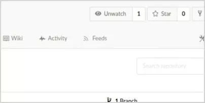

Gitea Feed Workaround Script
============================

A relatively simple script for generating RSS feeds for commits, 
releases, and issues on Gitea. 

#### FEATURES

- Generate feeds for commits, releases, and issues
- Selectively generate feeds based on the repository visibility
- Post in-band feed announcements 
- Easily import all feeds in other software as OPML or plain-text
- Configure and modify easily and freely

#### CAVEATS

- Computationally inefficient; likely scales poorly with repository count and activity
- Only sqlite3 databases are currently supported 
- Only GNU/Linux is currently supported
- No localization support

#### COMPATIBILITY

This script has been confirmed to work with Gitea version 1.11.0. Newer and older versions may work but are untested.

#### Screenshots

#### HOW TO INSTALL

1. Copy gitea-feed-workaround.sh to a persistent location.

2. Edit the variables at the beginning of `gitea-feed-workaround.sh`.
   Variables should reflect the configuration of your specific gitea 
   setup.
   
3. Run the script or install it as a system service. The user used to 
   run this script must have:
   
   * `read` access to the sqlite database file
   * `read` access to the git repositories
   * `read/write` access to output directories

By default, generated files can be accessed at: 

* `/_feeds/USER/REPOSITORY/commits.rss`
* `/_feeds/USER/REPOSITORY/issues.rss`
* `/_feeds/USER/REPOSITORY/releases.rss`
* `/_feeds/all/feeds.opml` (disabled by default)
* `/_feeds/all/feeds.txt` (disabled by default)

#### HOW IT WORKS

This script works by periodically polling Gitea's databases 
and git directories for recent updates. These updates are aggregated 
into static `.rss` files and hosted by a normal HTTP web server. Gitea 
itself can host these files by placing them in gitea's 
`custom/public` directory.

Considered updates are one of the following events:

* Any repository commit (which appears in `commits.rss`).
* Any change to a repository issue (which appears in `issues.rss`).
* Any new releases (which appears in `releases.rss`).
* Any announcement (which appears in all files mentioned above).
  
Only a limited number of the updates are included in each 
feed (with the exception of announcements, which are always included).
Updates are sorted by date and only the most recent are included. 

The data formats used by this script:

* RSS Version 2.0 for update feeds
* OPML Version 1.0 for feed enumeration

#### FEEDS MENU UI

If you want to add a "Feeds" tab to each repository page, copy 
or append `extra_tabs.tmpl` to the correct location. See the comments 
at the top of the file for more information. 

#### FEED ANNOUNCEMENTS

Announcements are special feed entries that are pinned in all 
generated feeds. They are derived from files stored in the 
announcements directory (ANNOUNCEMENT_DIR):

* The title of the announcement is derived from the name of the file. 
* The content of the announcement are derived from the content of 
  the file. Only plain text content is supported.
* The date of the announcement is derived from the last modification 
  date (as reported by the underlying filesystem).

Announcements are always included in every single feed. They persist 
until their source files are removed from the announcements
directory.

#### FEED ENUMERATION

This script can be configured to generate a complete list of every 
feed it generates. This list is meant to ease importing feeds in 
other software. By setting `ENABLE_GLOBAL_FEED_LISTS` to `YES`, a 
feeds list will be generated at `/_feeds/all/feeds.opml` and 
`/_feeds/all/feeds.txt`.

#### UPGRADE PATH TO NATIVE GITEA FEEDS

When Gitea inevitably introduces feed support, you can use Feed 
Announcements to let subscribers know about the changes and the 
migration schedule.

#### COMMERCIAL SUPPORT

Commercial integration and development support is available. Please 
send inquires to contact@ka.com.kw

#### BUGS AND SOURCE CODE

The source code of this project is maintained in a git repository 
at code.ka.com.kw. Bug reports and features request are welcome 
there. You can visit this repository at: 
https://code.ka.com.kw/miscellaneous/gitea-feed-workaround

Alternatively, you can report bugs to support@ka.com.kw

#### LICENSE

Files in this repository are available under the LGPLv3.

#### COPYRIGHT

(ح) حقوق المؤلف محفوظة لشركة كوتوميتا لبرمجة وتشغيل الكمبيوتر وتصميم 
وإدارة مواقع الإنترنت (ش.ش.و) - سنة ٢٠٢٠

تنفي الشركة أي مسئولية عن عدم أهلية البرنامج لأداء وظيفته المعلن عنها 
أو عن الأضرار التي قد يتكبدها المستخدم وغيره نتيجة استخدام هذا 
البرنامج. تقع مسؤولية أي ضرر ناجم عن استخدام هذا البرنامج على عاتق 
المستخدم وحده. اطلع على المستندات المرافقة لهذا البرنامج لمزيد من 
المعلومات.

Copyright © 2020 Kutometa SPC, Kuwait
All rights reserved. Unless explicitly stated otherwise, this program 
is provided AS IS with NO WARRANTY OF ANY KIND, INCLUDING THE 
WARRANTY OF MERCHANTABILITY AND FITNESS FOR A PARTICULAR PURPOSE. 
See accompanying documentation for more details.

